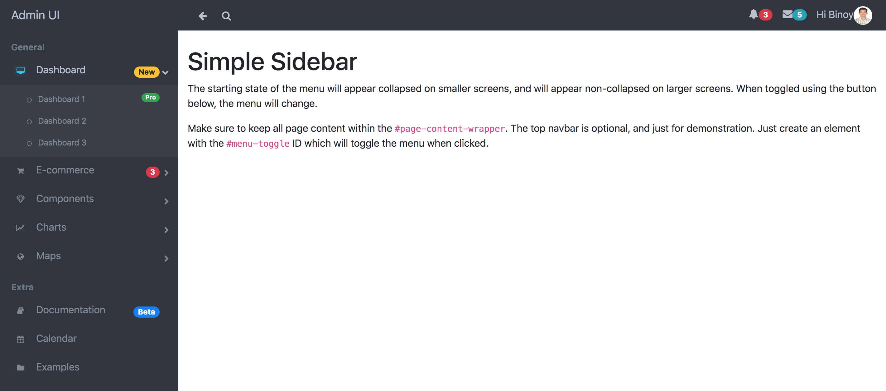
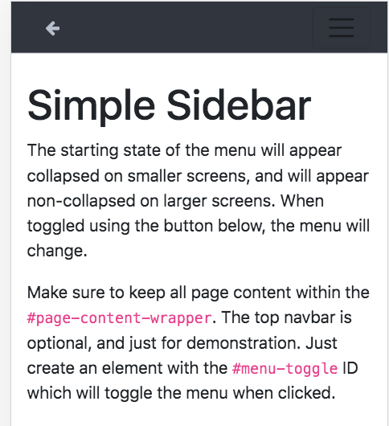
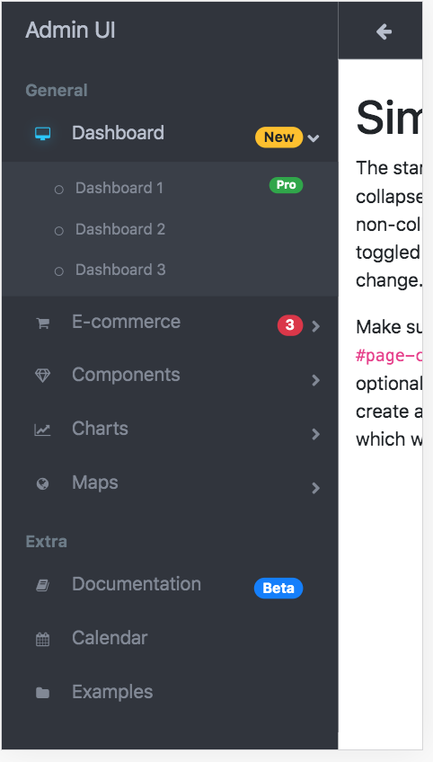

## Introduction
This project contains the fancy top and side navigation bar developed in react application with bootstrap. This navigation bar fully supported bootstrap 4.0.
## Run Command

* npm start

## Screens
The below screen desktop full view of top and side navigation bar.

The below screen mobile view.

The below screen side bar view on mobile view.

## References
* [Responsive Side Bar & Top Bar](https://startbootstrap.com/templates/simple-sidebar/)
* [Fancy Side Bar](https://bootsnipp.com/snippets/Q0dAX)
* [Admin UI](https://getbootstrapadmin.com/remark/iconbar/pages/email-articles.html)
